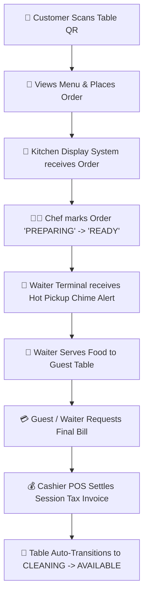

# ✨ AURA Gastronomy & Botanical Bar — Enterprise Digital Dining & POS Platform

<div align="center">

  
  
  
  
  
  

  <p align="center">
    <b>A state-of-the-art, real-time luxury restaurant management ecosystem.</b><br />
    Designed for high-speed dining operations: Contactless QR Ordering, Kitchen Display System (KDS), Waiter Floor Management, Cashier POS Billing, and Executive Analytics.
  </p>

  <p align="center">
    👤 <b>Created & Engineered by:</b> <a href="https://instagram.com/niranjan.ks.in"><b>Niranjan Kumar Singh</b></a><br />
    📸 <b>Instagram:</b> <a href="https://instagram.com/niranjan.ks.in"><code>@niranjan.ks.in</code></a>
  </p>

</div>

---

## 📖 Table of Contents
- [✨ Project Overview](#-project-overview)
- [👤 Author & Creator](#-author--creator)
- [🖥️ Core Terminals & Dashboard Links](#%EF%B8%8F-core-terminals--dashboard-links)
- [🔄 Complete End-to-End Operating Workflow](#-complete-end-to-end-operating-workflow)
- [💎 Key System Features](#-key-system-features)
- [🛠 Tech Stack & Architecture](#-tech-stack--architecture)
- [🚀 Quickstart Installation Guide](#-quickstart-installation-guide)
- [🌐 SEO & Social Metadata](#-seo--social-metadata)
- [📜 License](#-license)

---

## ✨ Project Overview

**AURA Gastronomy** is an enterprise-grade, highly scalable full-stack digital dining platform built to deliver an uncompromised luxury experience for guests while streamlining multi-department restaurant operations.

From table-side QR menu browsing to kitchen preparation queues, live waiter dispatch, and cashier tax invoice settlement, **AURA** connects customers, kitchen chefs, floor waiters, cashiers, and restaurant owners in seamless real-time synchronization.

---

## 👤 Author & Creator

| Attribute | Details |
| :--- | :--- |
| **Creator** | **Niranjan Kumar Singh** |
| **Instagram** | [**`@niranjan.ks.in`**](https://instagram.com/niranjan.ks.in) |
| **Role** | Lead Architect & Full-Stack Systems Engineer |
| **Project** | AURA Gastronomy & Botanical Bar Digital POS |

---

## 🖥️ Core Terminals & Dashboard Links

| Terminal / Portal | URL Path | Access Role | Description |
| :--- | :--- | :--- | :--- |
| 📱 **Customer Table Menu** | [`/menu?table=17`](http://localhost:5173/menu?table=17) | Guest / Customer | Contactless digital menu with dish customizations, category filters, cart drawer, and table-side ordering. |
| 📊 **Order Status & Receipt** | [`/orders/tracking`](http://localhost:5173/orders/tracking) | Guest / Customer | Live preparation timeline tracking, itemized receipt breakdown, and service call requests. |
| 🍳 **Kitchen Display System (KDS)** | [`/kitchen`](http://localhost:5173/kitchen) | Kitchen Staff / Chef | Real-time ticket queue for incoming orders with urgency timers, dish item checks, and status toggles (`Received` ➔ `Preparing` ➔ `Ready`). |
| 🤵 **Waiter Floor Terminal** | [`/waiter`](http://localhost:5173/waiter) | Waiter / Floor Staff | Interactive 30-table floor grid showing live occupancy, active order totals, ready food pickup alerts, call-waiter assistance notifications, and status transitions. |
| 💳 **Cashier POS & Tax Terminal** | [`/cashier`](http://localhost:5173/cashier) | Cashier / Billing | Live billing queue, itemized tax invoice compilation, bill splitting, payment settlement (`UPI_QR`, `CARD`, `CASH`), and searchable settlement archives. |
| 👑 **Owner Executive Portal** | [`/owner`](http://localhost:5173/owner) | Owner / Manager | Real-time shift revenue analytics, popular dish sales leaderboards, table occupancy statistics, and menu item availability controls. |

---

## 🔄 Complete End-to-End Operating Workflow



1. **Guest Seating & QR Ordering**:
   * Customer scans table QR code (e.g. Table 17), browses the rich visual menu, adds modifiers, and places an order (`ORD-5830`).
2. **Kitchen Preparation (KDS)**:
   * Order appears instantly on the Kitchen KDS board with prep countdown timer.
   * Chef updates ticket status: **Received ➔ Preparing ➔ Ready for Pickup**.
3. **Waiter Dispatch & Service**:
   * Waiter Dashboard plays an audio chime alert: *"Hot Food Ready at Kitchen Pass!"*.
   * Waiter delivers dish and marks order **`Served`**.
4. **Session Multi-Ordering**:
   * Guests can place additional orders during their session. All orders are automatically linked to the table session.
5. **Bill Settlement & Cleaning**:
   * Upon requesting the bill, Cashier POS compiles all session orders into **1 Unique Tax Invoice** (`INV-XXXXXX`).
   * Once payment is settled, the table status automatically transitions to **`CLEANING`**, ready for busboy reset.

---

## 💎 Key System Features

- ⚡ **Real-Time Synchronous State**: Active orders and floor states update automatically across all screens.
- 🧾 **Cumulative Session Invoicing**: Multi-order sessions are consolidated under a single unique tax invoice (`INV-XXXXXX`) upon checkout.
- 🛡️ **Intelligent Status Safeguards**: Prevents invalid floor status transitions (e.g. reverting a billing table directly back to dining without settlement).
- 🔔 **Call Waiter & Service Requests**: Customers can request water refills, napkins, extra plates, or the final bill with 1-tap notifications sent to floor staff.
- 🔍 **Searchable Cashier Archive**: Filter and search settled invoices by order ID, invoice number, customer phone, or table number.

---

## 🛠 Tech Stack & Architecture

### **Frontend**
* **Framework**: React 19 + TypeScript + Vite
* **Styling**: Vanilla CSS Design System + Tailwind CSS
* **Icons**: Lucide React Icons
* **Networking**: Axios HTTP Client

### **Backend**
* **Runtime**: Node.js + Express.js
* **Database**: MongoDB Atlas + Mongoose ORM
* **REST API**: Modular Route Controllers (`orderRoutes.js`, `tableRoutes.js`, `menuRoutes.js`)

---

## 🚀 Quickstart Installation Guide

### Prerequisites
* **Node.js**: `v18+` or `v20+`
* **npm**: `v9+`
* **MongoDB**: Local MongoDB instance or MongoDB Atlas Connection URI

### 1. Clone the Repository
```bash
git clone https://github.com/Niranjan-Kumar-Singh/AURA-GASTRONOMY-RESTAURANT.git
cd AURA-GASTRONOMY-RESTAURANT
```

### 2. Backend Environment & Setup
```bash
cd backend
npm install
```

Create a `.env` file in the `backend` folder:
```env
PORT=5000
MONGODB_URI=your_mongodb_connection_string
NODE_ENV=development
```

Start the Backend Server:
```bash
npm start
# Server will run on http://localhost:5000
```

### 3. Frontend Setup & Run
```bash
cd ../frontend
npm install
npm run dev
# Vite dev server will run on http://localhost:5173
```

---

## 🌐 SEO & Social Metadata

The project incorporates complete **SEO Best Practices**:
* **Structured Data**: JSON-LD Schema markup for restaurant entity.
* **Open Graph Tags**: Tailored `og:title`, `og:description`, and `og:image` tags.
* **Twitter Cards**: Summary card configuration for social previews.
* **Mobile Responsive Meta**: Optimized viewport settings and dynamic dark theme color (`#0F0F11`).

---

## 📜 License & Credits

Distributed under the **MIT License**. Created with ❤️ by **Niranjan Kumar Singh** ([`@niranjan.ks.in`](https://instagram.com/niranjan.ks.in)).
