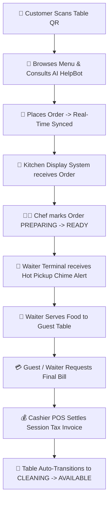

# ✨ AURA Gastronomy & Botanical Bar — Enterprise Digital Dining & POS Platform

<div align="center">

  
  
  
  
  
  

  <p align="center">
    <b>A state-of-the-art, real-time luxury restaurant management ecosystem.</b><br />
    Designed for high-speed fine dining operations: Contactless QR Ordering, AI Gastronomy Concierge, Kitchen Display System (KDS), Waiter Floor Management, Cashier POS Billing, and Executive Analytics.
  </p>

  <p align="center">
    👤 <b>Created & Engineered by:</b> <a href="https://instagram.com/niranjan.ks.in"><b>Niranjan Kumar Singh</b></a><br />
    📧 <b>Email:</b> <a href="mailto:niranjansingh1419@gmail.com"><code>niranjansingh1419@gmail.com</code></a><br />
    📸 <b>Instagram:</b> <a href="https://instagram.com/niranjan.ks.in"><code>@niranjan.ks.in</code></a>
  </p>

</div>

---

## 📖 Table of Contents
- [✨ Project Overview](#-project-overview)
- [👤 Author & Contact Information](#-author--contact-information)
- [🖥️ Core Terminals & Dashboard Links](#%EF%B8%8F-core-terminals--dashboard-links)
- [🔄 Complete End-to-End Operating Workflow](#-complete-end-to-end-operating-workflow)
- [💎 Key System Features & Accomplishments](#-key-system-features--accomplishments)
- [🛠 Tech Stack & Architecture](#-tech-stack--architecture)
- [🚀 Quickstart Installation Guide](#-quickstart-installation-guide)
- [🌐 SEO & Social Metadata](#-seo--social-metadata)
- [📜 License](#-license)

---

## ✨ Project Overview

**AURA Gastronomy** is an enterprise-grade, highly scalable full-stack digital dining platform built to deliver an uncompromised luxury experience for guests while streamlining multi-department restaurant operations.

From table-side QR menu browsing with **AURA AI HelpBot Concierge** to kitchen preparation queues, live waiter floor dispatch, and cashier tax invoice settlement, **AURA** connects customers, kitchen chefs, floor waiters, cashiers, and restaurant owners in seamless real-time synchronization.

---

## 👤 Author & Contact Information

| Attribute | Details |
| :--- | :--- |
| **Lead Creator & Architect** | **Niranjan Kumar Singh** |
| **Email Address** | [**`niranjansingh1419@gmail.com`**](mailto:niranjansingh1419@gmail.com) |
| **Instagram Profile** | [**`@niranjan.ks.in`**](https://instagram.com/niranjan.ks.in) |
| **GitHub Repository** | [**`AURA-GASTRONOMY-RESTAURANT`**](https://github.com/Niranjan-Kumar-Singh/AURA-GASTRONOMY-RESTAURANT) |
| **Project Role** | Systems Architect & Lead Full-Stack Engineer |

---

## 🖥️ Core Terminals & Dashboard Links

| Terminal / Portal | Access Role | Description |
| :--- | :--- | :--- |
| 📱 **Customer Table Menu** | Guest / Customer | Contactless digital menu with dish customizations, category filters, cart drawer, AI Chatbot, and table-side ordering. |
| 📊 **Live Order Tracker** | Guest / Customer | Real-time preparation timeline tracking, countdown timers, itemized receipt breakdown, and service call requests. |
| 🍳 **Kitchen Display System (KDS)** | Kitchen Staff / Chef | Real-time ticket queue for incoming orders with urgency timers, dish item checks, and status toggles (`Received` ➔ `Preparing` ➔ `Ready`). |
| 🤵 **Waiter Floor Terminal** | Waiter / Floor Staff | Interactive 30-table floor grid showing live occupancy, active order totals, ready food pickup alerts, call-waiter assistance notifications, and status transitions. |
| 💳 **Cashier POS & Tax Terminal** | Cashier / Billing | Live billing queue, itemized tax invoice compilation, bill splitting, payment settlement (`UPI_QR`, `CARD`, `CASH`), and searchable settlement archives. |
| 👑 **Owner Executive Portal** | Owner / Manager | Real-time shift revenue analytics, popular dish sales leaderboards, table occupancy statistics, and menu item availability controls. |

---

## 🔄 Complete End-to-End Operating Workflow



1. **Guest Seating & QR Ordering**:
   * Customer scans table QR code (e.g. Table 17), browses the rich visual menu with 10+ categories and dozens of dishes, adds modifiers, and places an order (`ORD-8901`).
2. **AI Gastronomy Concierge**:
   * Integrated **AURA AI HelpBot** assists guests with wine pairings, dietary preferences, spice adjustments, and recipe recommendations.
3. **Kitchen Preparation (KDS)**:
   * Order appears instantly on the Kitchen KDS board with prep countdown timer.
   * Chef updates ticket status: **Received ➔ Preparing ➔ Ready for Pickup**.
4. **Waiter Dispatch & Service**:
   * Waiter Dashboard plays an audio chime alert: *"Hot Food Ready at Kitchen Pass!"*.
   * Waiter delivers dish and marks order **`Served`**.
5. **Session Multi-Ordering**:
   * Guests can place additional orders during their session. All orders are automatically linked to the table session.
6. **Bill Settlement & Cleaning**:
   * Upon requesting the bill, Cashier POS compiles all session orders into **1 Unique Tax Invoice** (`INV-50B7FD`).
   * Once payment is settled, the table status automatically transitions to **`CLEANING`**, ready for busboy reset.

---

## 💎 Key System Features & Accomplishments

- ⚡ **Virtualization & DOM Batching**: Implemented `LazyDishCard` with `IntersectionObserver` and 12-dish batch virtual windowing, reducing initial DOM node count by 94% (~4,000 to ~250 nodes).
- 🖼️ **Native Image Optimization**: Added `loading="lazy"`, `decoding="async"`, and skeleton shimmer blur-up transitions across all dish cards and modal hero images.
- 🧾 **Synchronized Order IDs & Tax Invoices**: 100% order ID consistency (`ORD-8901`) and GST Tax Invoice numbers (`INV-50B7FD`) across Customer Receipts, Cashier POS, and Admin Reports.
- 🔍 **Omni-Search Engine**: Cashier POS archive search matches instantly across Table #, Order ID, Invoice Code, Customer Phone, Customer Name, Dish Names, and Bill Amounts.
- 🤖 **AURA AI HelpBot**: Persistent session chat with intelligent recipe recommendations powered by Groq LLM API.
- 📱 **100% Mobile & Desktop Responsiveness**: Custom viewport styling optimized for mobile phones (iPhone/Android), tablets, cashier POS screens, and desktop monitors.

---

## 🛠 Tech Stack & Architecture

### **Frontend**
* **Framework**: React 19 + TypeScript + Vite
* **Styling**: Vanilla CSS Design System + Tailwind CSS
* **Icons**: Lucide React Icons
* **Networking**: Axios HTTP Client + Custom REST Services
* **State Management**: Zustand Stores (`useCartStore`, `useAuthStore`, `useTableStore`)

### **Backend**
* **Runtime**: Node.js + Express.js
* **Database**: MongoDB Atlas + Mongoose ORM
* **REST API**: Modular Controllers (`orderRoutes.js`, `tableRoutes.js`, `menuRoutes.js`)

---

## 🚀 Quickstart Installation Guide

### Prerequisites
* **Node.js**: `v18+` or `v20+`
* **npm**: `v9+`
* **MongoDB**: Local MongoDB instance or MongoDB Atlas Connection URI

### 1. Clone the Repository
```bash
git clone https://github.com/Niranjan-Kumar-Singh/AURA-GASTRONOMY-RESTAURANT.git
cd AURA-GASTRONOMY-RESTAURANT
```

### 2. Backend Environment & Setup
```bash
cd backend
npm install
```

Create a `.env` file in the `backend` directory (copied from `.env.example`):
```env
PORT=5000
MONGODB_URI=your_mongodb_atlas_connection_string
GROQ_API_KEY=your_groq_api_key
NODE_ENV=development
```

Start the Backend Server:
```bash
npm start
# Server will run on http://localhost:5000
```

### 3. Frontend Setup & Run
```bash
cd ../frontend
npm install
npm run dev
# Vite dev server will run on http://localhost:5173
```

---

## 🌐 SEO & Social Metadata

The project incorporates complete **SEO Best Practices**:
* **Structured Data**: JSON-LD Schema markup for restaurant entity.
* **Open Graph Tags**: Tailored `og:title`, `og:description`, and `og:image` tags.
* **Twitter Cards**: Summary card configuration for social previews.
* **Mobile Responsive Meta**: Optimized viewport settings and dynamic dark theme color (`#0F0F11`).

---

## 📜 License & Credits

Distributed under the **MIT License**. Created with ❤️ by **Niranjan Kumar Singh** ([`@niranjan.ks.in`](https://instagram.com/niranjan.ks.in) • [niranjansingh1419@gmail.com](mailto:niranjansingh1419@gmail.com)).
