# 🌿 AURA Gastronomy — Luxury Digital Dining & Restaurant OS

<div align="center">

  
  
  
  <br />
  
  
  
  
  

  <br /><br />

  <p align="center">
    <b>A high-performance, real-time luxury restaurant operating system built from the ground up.</b><br />
    Opaque QR Tokens · Pure <code>/menu</code> Clean URLs · Terminal-Authorized 1-Click Dashboards · Chef KDS with Dish 86 · Waiter Floor Dispatch · Cashier POS · Partial & Item-Level Refunds · Gamified Loyalty Engine · Enterprise Security
  </p>

  <p align="center">
    👤 <b>Designed & Crafted by:</b> <a href="https://github.com/Niranjan-Kumar-Singh"><b>Niranjan Kumar Singh</b></a><br />
    📧 <b>Direct:</b> <a href="mailto:niranjansingh1419@gmail.com"><code>niranjansingh1419@gmail.com</code></a> &nbsp;|&nbsp; 📸 <b>Instagram:</b> <a href="https://instagram.com/niranjan.ks.in"><code>@niranjan.ks.in</code></a>
  </p>

</div>

---

## 🍽️ The Vision Behind AURA

In fine dining, true luxury lives in the unspoken details.

A diner shouldn't have to wave down a waiter across a crowded floor just for a carafe of water or an extra basket of garlic naan. A chef shouldn't have to squint through kitchen steam at crumpled paper tickets during a slammed Friday night rush. A cashier shouldn't be forced to void an entire ₹6,000 banquet invoice simply because a single dessert was out of stock. And a restaurant owner shouldn't have to guess where their net margins went at 1:00 AM.

**AURA Gastronomy** was built to solve these exact friction points. It connects diners, floor staff, the pass, and executive management into one synchronized system:

* **For Diners:** Zero app downloads. Scan the table's stand, browse dishes with mouth-watering photography, consult the AI dining concierge, and track cooking progress in real time.
* **For the Line:** A responsive Kitchen Display System (KDS) where line chefs can 86 unavailable dishes on the fly, automatically recomputing bills without interrupting the rest of the meal.
* **For Waitstaff:** A 30-table interactive floor grid with audio chime dispatch, instant call management, and digital bill requests.
* **For Cashiers & Owners:** Clean POS settlement, item-level partial refunds, GST invoicing, and live revenue analytics reflecting actual retained income.

> 🌿 *The fine-dining concept showcasing this system is* **RASA** *— Sanskrit for essence, taste, and aesthetic emotion. Every typography choice, glassmorphism card, and sound chime was tailored to reflect modern culinary elegance.*

---

## 💎 Core Engineering Highlights

### 1. 🛡️ Opaque Cryptographic Table QR Tokens & Clean URLs
Most restaurant QR systems expose the table number directly in the URL (e.g. `domain.com/table/12/menu`). This is inherently insecure: guests can change the URL to `table/5/menu` and accidentally order dishes on someone else's bill.
* **Opaque Tokens:** Every physical table stand contains a unique, high-entropy cryptographic token (`/dine/:qrToken`).
* **Clean Customer Browsing:** Once scanned, the system creates a secure table session and transitions diners to a pristine, table-agnostic URL: `http://localhost:5173/menu`.
* **Tamper-Resistant:** Diners can refresh, browse categories, or revisit dishes without ever having table parameters exposed in their browser address bar.
* **Token Rotation:** Floor managers can rotate a table's QR token with one click if a stand is compromised, instantly invalidating old links.

### 2. 🔐 Terminal-Authorized 1-Click Staff Access
Staff dashboards need to be fast during peak service, but public visitors shouldn't be able to click their way into the Head Chef or Cashier accounts:
* **Hardware Station Authorization:** Tablets mounted in the kitchen or POS iPads are authorized via a Master Terminal Passcode (`AURA2026`) or instant link pairing (`/login?terminalKey=AURA2026`).
* **Guest Protection:** Unverified devices display a locked terminal shield, keeping 1-click role presets hidden while allowing standard email/password logins.
* **Quick Locking:** Staff can lock the terminal with a single tap at the end of their shift.

### 3. 🍳 Chef KDS with Individual Dish 86 & Live Recalculation
Real kitchens run on ingredient availability. If the fresh truffles run dry or saffron stock depletes mid-shift, you shouldn't have to cancel the guest's whole table order:
* **Per-Item Cancellation (86'd):** Chefs can cancel individual dishes directly from the kitchen screen with kitchen-standard reasons (*86'd / Out of Ingredients*, *Prep Defect*, *Equipment Station Delay*).
* **Automatic Financial Recalculation:** Subtotal, 5% GST, and net bill are immediately recalculated on the fly.
* **Customer Transparency:** The guest's active tracking screen marks the item with a clear `Cancelled by Kitchen: [Reason]` badge and updates the live bill instantly.
* **Cascade Void:** If all dishes in a ticket are cancelled, the entire order cleanly transitions to cancelled, credits back any redeemed points, and triggers table turnover.

### 4. 💳 Item-Level Partial Refunds & Net Revenue Auditing
Most POS systems treat refunds as an all-or-nothing action. In AURA:
* **Item-Specific Deductions:** Cashiers can refund a single starter or beverage out of an eight-item invoice without voiding the table session.
* **Custom Rupee Offsets:** Staff can enter precise compensation amounts with recorded audit reasons and staff credentials.
* **True Net Revenue:** The Owner Dashboard and hourly analytics deduct refunds to present actual retained revenue rather than inflated gross figures.

### 5. 🎁 Gamified Loyalty & Dining Points Engine
Built directly into the customer ordering flow without clunky third-party apps:
* **Post-Dining Review Rewards:** Diners earn instant loyalty coins (+50 pts) for sharing verified feedback after their meal.
* **Tiered Cart Redemption:** Guests can redeem accumulated points at checkout (100 pts → ₹50 off, 200 pts → ₹120 off, 300 pts → ₹200 off).
* **Audit-Proof Transactions:** Every point earned or spent is recorded in `LoyaltyTransaction` with balance integrity checks and automatic refund rollback.

### 6. 🛡️ Server-Side Security & Price Anti-Tampering
* **Zero Client Trust:** Dish prices submitted in checkout payloads are ignored. The backend retrieves official menu prices from MongoDB and recomputes subtotals, tax, and discounts server-side.
* **Recursive NoSQL Sanitization:** Global middleware strips out malicious MongoDB query operators (`$where`, `$ne`, `$gt`, prototype pollution).
* **ReDoS & CastError Hardening:** Malicious regex search inputs are escaped; malformed ObjectIds return clean `400 Bad Request` responses instead of crashing the Node process.
* **Multi-Tier Rate Limiting:** Brute-force protection on authentication, order submission, loyalty claims, and public APIs.

---

## 🖥️ Portals & Live Dashboard Links

| Station / Terminal | Primary Audience | Core Capabilities |
|:---|:---|:---|
| 📱 **Customer QR Menu** | Diners | Pure `/menu` URL, dietary filters (Veg, Non-Veg, Jain), dish notes, AI Dining Concierge |
| ⏱️ **Live Order Tracker** | Diners | Real-time 4-stage timeline (`Received → Preparing → Ready → Served`), cancellation badges, live bill |
| 🍳 **Kitchen Display (KDS)** | Head Chef & Line Cooks | Order cards, elapsed time counters, item checkboxes, Dish 86 cancellation modal, ticket void |
| 🤵 **Waiter Floor Terminal** | Service Staff | 30-table interactive layout, live status (`Vacant`, `Occupied`, `Cleaning`), pickup bell chimes, QR stand manager |
| 💳 **Cashier POS Station** | Cashiers & Floor Leads | Active session bills, split-check, GST invoice printing, multi-tender payment (UPI QR / Card / Cash), item refunds |
| 👑 **Owner Executive Suite** | Owners & General Managers | Net revenue metrics, authentic 24-hour service volume heatmap, popular dish rankings, category profit shares |
| 🔐 **Staff Access Portal** | Team Members | Hardware-authorized terminal mode + Role-Based Access Control (`CHEF`, `WAITER`, `CASHIER`, `ADMIN`, `RESTAURANT_OWNER`) |

---

## 🔄 The Complete Dining Flow

```mermaid
flowchart LR
    A[📱 Guest Scans Table QR] --> B[✨ Resolved to Clean /menu]
    B --> C[📖 Explore Dishes & AI Concierge]
    C --> D[🛒 Add to Cart & Apply Loyalty]
    D --> E[🚀 Submit Order Ticket]
    E --> F[🍳 KDS Receives Ticket Instantly]
    F --> G[👨‍🍳 Chef Cooks · 86 Unavailables]
    G --> H[🔔 Waiter Terminal Chime & Pickup]
    H --> I[🤵 Dish Served to Table]
    I --> J[💳 Guest Requests Bill / POS Settle]
    J --> K[💵 Cashier Prints GST Invoice]
    K --> L[⭐ Diner Leaves Feedback & Gets Points]
    L --> M[🧹 Table Cleaning Countdown]
    M --> N[✨ Table Resets to Vacant]
```



---

## 🛠️ Technology Stack

### Client Layer
* **Framework:** React 19 + TypeScript + Vite 5
* **State Management:** Zustand (Cart, Session, Auth, Order stores)
* **Styling & Design:** Tailwind CSS + Vanilla CSS Tokens (Theme variables, Glassmorphism, Dark Mode)
* **Performance:** Manual chunk splitting (`vendor-core`, `vendor-libs`, `icons`, `index`) — **0 TypeScript errors**
* **Audio Feedback:** Web Audio API synthesizer for waiter chimes and alert bells

### Server Layer
* **Runtime:** Node.js + Express 5 (Modular route architecture)
* **Database:** MongoDB Atlas + Mongoose (High-efficiency compound indexing)
* **AI Intelligence:** Groq LLM API (`llama-3.3-70b-versatile` tool-calling concierge)
* **Security Suite:** Helmet HTTP headers, express-rate-limit, recursive NoSQL sanitizer, bcrypt password hashing, JWT authentication
* **Process Lifecycle:** Clean shutdown handling (`SIGTERM`/`SIGINT`), connection pooling, unhandled rejection safety

---

## 🚀 Quick Start Guide

### Prerequisites
* **Node.js** `v18+` or `v20+`
* **npm** `v9+`
* **MongoDB** (Cloud MongoDB Atlas or Local MongoDB instance)
* **Groq API Key** *(Optional, for AI Sommelier Chatbot from [console.groq.com](https://console.groq.com))*

---

### 1. Clone & Setup Workspace
```bash
git clone https://github.com/Niranjan-Kumar-Singh/AURA-GASTRONOMY-RESTAURANT.git
cd AURA-GASTRONOMY-RESTAURANT
```

### 2. Configure & Run Backend
```bash
cd backend
npm install
```

Create a `.env` file inside `backend/`:
```env
PORT=5000
MONGO_URI=your_mongodb_connection_string
JWT_SECRET=your_super_strong_random_jwt_secret
GROQ_API_KEY=your_groq_api_key_optional
NODE_ENV=development
```

Start the backend:
```bash
npm start
# ➜ Server running on port 5000 (accessible on LAN) with Enterprise Security
# ➜ MongoDB Connected: ac-cluster...
```

### 3. Launch the Frontend
Open a second terminal:
```bash
cd frontend
npm install
npm run dev
# ➜ Local: http://localhost:5173/
```

### 4. Direct Portal URLs

* 📱 **Customer Clean Menu:** [http://localhost:5173/menu](http://localhost:5173/menu)
* 🍳 **Kitchen Display (KDS):** [http://localhost:5173/kitchen](http://localhost:5173/kitchen)
* 🤵 **Waiter Floor Plan:** [http://localhost:5173/waiter](http://localhost:5173/waiter)
* 💳 **Cashier POS:** [http://localhost:5173/cashier](http://localhost:5173/cashier)
* 👑 **Owner Dashboard:** [http://localhost:5173/owner](http://localhost:5173/owner)
* 🔐 **Staff Login:** [http://localhost:5173/login](http://localhost:5173/login) *(Station Passcode: `AURA2026`)*

---

## 🧪 Automated Test Verification

AURA includes self-contained automated verification suites that validate business rules and security bounds without relying on manual clicks:

```bash
# 1. Run Kitchen 86 & Cancellation Suite
node backend/tools/test_cancellation.js
# ➜ 10/10 TESTS PASSED (Dish 86, subtotal recalculation, lockout guards, cascade void)

# 2. Run Enterprise Security Suite
node backend/tools/test_security.js
# ➜ 5/5 PASSED (Price anti-tampering, ReDoS mitigation, CastError safety, compound indexes)
```

---

## 👨‍🍳 Author & Engineering Credits

Crafted with care, culinary passion, and attention to detail by **Niranjan Kumar Singh**.

* 🌐 **GitHub:** [@Niranjan-Kumar-Singh](https://github.com/Niranjan-Kumar-Singh)
* 📸 **Instagram:** [@niranjan.ks.in](https://instagram.com/niranjan.ks.in)
* 📧 **Email:** [niranjansingh1419@gmail.com](mailto:niranjansingh1419@gmail.com)
* 💼 **Repository:** [AURA-GASTRONOMY-RESTAURANT](https://github.com/Niranjan-Kumar-Singh/AURA-GASTRONOMY-RESTAURANT)

---

## 📄 License

This software is released under the **MIT License**. You are free to explore, customize, and deploy it for your dining establishments.

<div align="center">
  <br />
  <sub>🌿 <b>RASA</b> — <em>Crafted with obsessive precision for the future of hospitality.</em></sub>
</div>
