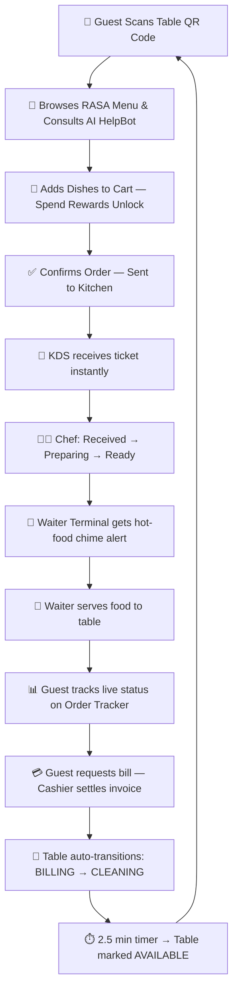

# 🌿 AURA Gastronomy — Enterprise Digital Dining & Restaurant OS

<div align="center">

  
  
  
  <br />
  
  
  
  
  

  <br /><br />

  <p align="center">
    <b>A state-of-the-art, real-time luxury restaurant management ecosystem.</b><br />
    Contactless QR Ordering · AI Gastronomy Concierge · Kitchen Display System · Waiter Floor Terminal · Cashier POS · Executive Analytics
  </p>

  <p align="center">
    👤 <b>Created & Engineered by:</b> <a href="https://instagram.com/niranjan.ks.in"><b>Niranjan Kumar Singh</b></a><br />
    📧 <b>Email:</b> <a href="mailto:niranjansingh1419@gmail.com"><code>niranjansingh1419@gmail.com</code></a><br />
    📸 <b>Instagram:</b> <a href="https://instagram.com/niranjan.ks.in"><code>@niranjan.ks.in</code></a>
  </p>

</div>

---

## 📖 Table of Contents
- [✨ Project Overview](#-project-overview)
- [🆕 What's New — Latest Updates](#-whats-new--latest-updates)
- [🖥️ Core Terminals & Dashboard Links](#️-core-terminals--dashboard-links)
- [🔄 End-to-End Operating Workflow](#-end-to-end-operating-workflow)
- [💎 Key Features & Accomplishments](#-key-features--accomplishments)
- [🛠 Tech Stack & Architecture](#-tech-stack--architecture)
- [🚀 Quickstart Installation Guide](#-quickstart-installation-guide)
- [👤 Author & Contact](#-author--contact)
- [📜 License](#-license)

---

## ✨ Project Overview

**AURA Gastronomy** is an enterprise-grade, full-stack **Digital Dining & Restaurant Operating System** — built to deliver an uncompromised luxury experience for guests while streamlining every department of a modern restaurant in seamless real-time.

> 🌿 *The restaurant brand powering this platform is* **RASA** *— Sanskrit for "essence, flavor & emotion". The name reflects the philosophy that every great dish tells a story.*

From a guest's first QR scan to a chef's final ticket mark, waiter dispatch, cashier settlement, and table reset — **AURA** connects customers, kitchen chefs, floor waiters, cashiers, and restaurant owners in one synchronized real-time ecosystem.

---

## 🆕 What's New — Latest Updates

### ✦ 1-Tap Quick Water Refill & Balanced Floating Action Hub
- **Instant Water Refill Action**: Added dedicated `WaterRefillButton` floating action trigger allowing diners to alert waitstaff for a water refill with a single tap. Features visual state feedback (`Water Requested ✓`), 30-second cooldown auto-reset, animated status indicators, and audio/toast confirmation.
- **Harmonized Floating Button Spacing**: Implemented a balanced 16px vertical gap between the **Water Refill** and **Call Waiter** floating buttons across all viewports (mobile and desktop) and across all cart states (both when the floating active cart bar is open or collapsed), eliminating overlapping or attached buttons.

### ✦ 60fps GPU-Accelerated Smooth Header Scroll Dynamics
- Replaced jittery scroll jump with an accumulated scroll distance listener (`accumulatedDistance >= 25px` downward to collapse, `>= 20px` upward to reveal, `<= 45px` top reset).
- Engineered a dual-layer hardware-accelerated CSS Grid (`gridTemplateRows: 1fr` <-> `0fr`) and `maxHeight` (`70px` <-> `0px`) transition with `minHeight: 0`, completely eliminating layout jumps and phantom scroll lag.

### ✦ Luxury Faded Dark Recommendation Rails
- **Chef's Signature Recommendations**: Styled with a rich, faded dark roasted espresso and hazelnut gradient (`from-[#332517]/95 via-[#261d15]/90 to-[#1d1610]/75`) with glowing amber badges and warm card hover borders.
- **Today's Most Popular Specials**: Styled with a muted cypress and jade faded dark gradient (`from-[#173023]/95 via-[#13241b]/90 to-[#0e1b14]/75`) with emerald flame badges.
- Elevated visual hierarchy with crisp white cards nestled cleanly against faded dark backdrops for a fine-dining feel.

### ✦ Resilient Table Cart Synchronization & Guest Access
- **Zero-Loss Cart Store Hydration**: `fetchServerCart` now protects local cart items against accidental blank overwrites (`[]`), automatically re-synchronizing local items back to the table session.
- **Unblocked Guest Ordering**: Removed strict authentication requirements on adding items, allowing table guests to browse and assemble their cart immediately upon scanning.
- **Preserved Order Tracking Cart**: Removed destructive mount-time cart clearing on `OrderTrackingPage`, enabling seamless additional dish orders from gastronomy live reels and suggestion carousels.

### ✦ Waiter Dashboard Live Table Cleaning Countdown & Safety Guards
- **Live 2m 30s Countdown**: Floor grid tiles now display a live countdown timer (`CLEAN (2m 14s)`) with broom icon badge for tables currently in the cleaning cycle.
- **Strict Transition Guards**: Prevented occupied tables with active dining sessions or unpaid balances from being marked as cleaning until the bill has been settled at Cashier POS.

### ✦ Cashier POS VIP Member Privileges
- Integrated a dedicated 👑 **VIP Privileged Member** discount tier (15% savings) with custom badge, real-time recalculation, and branded itemized tax receipt prints.

### ✦ Multi-Quantity Dish Add-On Steppers
- Upgraded **Dish Detail Modal** with per-item stepper controls (`+` / `-`) for recommended add-ons and pairings.
- Guests can now easily order multiple units of specific add-ons (e.g. 2× Truffle Garlic Butter, 3× Smoked Chili Dip) with live subtotal math and full cart synchronization.

### ✦ Mobile Viewport Perfection & Full-Width Drawers
- **Zero-Gap Mobile Panels**: Standardized `CustomerSidebar`, `CartDrawer`, `WishlistDrawer`, `OffersDrawer`, and `OrderHistoryDrawer` to expand 100% full width on mobile viewports (`<768px`), eliminating side margin gaps.
- **Edge-to-Edge Bottom Sheet**: Transformed `DishDetailModal` into a responsive mobile bottom sheet docked seamlessly to the bottom with rounded top corners.
- **Clean Mobile Header**: Re-engineered the top navigation bar with a compact 36px live kitchen tracker button and persistent restaurant branding with zero text crowding or collision.

### ✦ Adaptive Zero-Line Scrollbar System
- Removed `scrollbar-gutter: stable` and eliminated all hardcoded dark scrollbar tracks (`#090A0F`).
- Globally adopted **100% transparent scrollbar tracks** (`background: transparent !important`) paired with subtle floating slate pill thumbs that only appear when content actually overflows vertically.

### ✦ Customer Experience Overhaul
- **Order Tracking Page** completely rebuilt with customer engagement features:
  - 🍳 **Chef's Wisdom** — rotating curated culinary quotes from the kitchen
  - 💡 **Did You Know?** — rotating dining knowledge facts carousel
  - 🛒 **While You Wait** — quick-add prompts for salads, drinks, breads, desserts
  - ⭐ **You Might Also Love** — live recommended dishes fetched from the real menu
  - 📶 **Amenities Card** — WiFi password, Live Music schedule, Help CTA
  - 🌟 **Star Rating Teaser** — inline experience feedback prompt

### ✦ Cart Engagement (CartDrawer)
- Replaced static prep-time banner with **rotating contextual tips** (5 smart dining suggestions)
- Added **AI-Powered "Pairs Perfectly" strip** — horizontal carousel of recommended pairings from the `aiPairingEngine`

### ✦ Auto Table Cleanup Lifecycle
- After bill payment, table auto-enters `CLEANING` status
- **Timer reduced from 5 minutes → 2.5 minutes** for faster table turnaround
- At 2.5 min, table automatically transitions `CLEANING → AVAILABLE` on next API poll
- Zero manual intervention needed from floor staff

### ✦ Typography System — Complete Overhaul
Full 4-font premium restaurant typography stack:

| Font | Role | Context |
|:---|:---|:---|
| **Poppins** | Primary UI body | Customer menu, cart, tracking — perfect ₹ glyph rendering |
| **Sora** | Display headings | Section titles, page headers — geometric, premium |
| **Inter** | Staff dashboards | Kitchen, Waiter, Cashier, Admin — compact, data-dense |
| **JetBrains Mono** | POS terminal numbers | Cashier & Kitchen IDs only — terminal precision |

> **Key fix:** Prices on customer screens now use **Poppins + `font-variant-numeric: tabular-nums`** instead of a monospace font — the same approach used by Blinkit, Swiggy, and Zomato. The ₹ symbol now renders at the correct optical weight alongside digits.

---

## 🖥️ Core Terminals & Dashboard Links

| Terminal / Portal | Role | Description |
|:---|:---|:---|
| 📱 **Customer Table Menu** | Guest | Contactless QR menu, category filters, dish cards, AI Chatbot concierge, cart drawer with spend rewards |
| 📊 **Live Order Tracker** | Guest | Real-time 4-step preparation timeline, chef wisdom, dish suggestions, amenity info |
| 🍳 **Kitchen Display (KDS)** | Chef | Ticket queue with urgency timers, `Received → Preparing → Ready` status toggles |
| 🤵 **Waiter Floor Terminal** | Waiter | 30-table interactive floor map, occupancy status, food pickup chime alerts, call-waiter notifications |
| 💳 **Cashier POS Terminal** | Cashier | Live billing queue, GST tax invoices, multi-payment settlement (`UPI`, `CARD`, `CASH`), archive search |
| 👑 **Owner Executive Portal** | Owner | Real-time revenue, popular dish leaderboards, occupancy stats, menu availability controls |

---

## 🔄 End-to-End Operating Workflow



**Step-by-step:**

1. **Guest Arrival & QR Ordering** — Customer scans table QR, browses the visual menu with 10+ categories, adds dishes with cooking notes and customizations, unlocks spend-tier rewards, and places order.
2. **AI Gastronomy Concierge** — AURA HelpBot assists guests with wine pairings, dietary preferences, spice levels, and recipe stories in real-time chat.
3. **Kitchen Preparation (KDS)** — Order appears on KDS board with urgency timer. Chef progresses status: `Received → Preparing → Ready`.
4. **Waiter Dispatch** — Waiter terminal plays audio chime. Waiter picks up dish and marks `Served`.
5. **Live Order Tracking** — Customer sees 4-step progress tracker, chef wisdom, and menu suggestions while waiting.
6. **Multi-Order Sessions** — Guests can place additional orders anytime during their session. All orders aggregate to the table session.
7. **Bill Settlement** — Cashier compiles all session orders into one GST tax invoice. Payment settled via UPI/Card/Cash.
8. **Auto Table Reset** — Table enters `CLEANING` automatically. After **2.5 minutes**, it transitions to `AVAILABLE` — ready for the next guest.

---

## 💎 Key Features & Accomplishments

### ⚡ Performance
- **`LazyDishCard` Virtual Windowing** — `IntersectionObserver` with 12-dish batch rendering reduces DOM nodes from ~4,000 to ~250 (94% reduction)
- **Native Image Optimization** — `loading="lazy"`, `decoding="async"`, and shimmer skeleton transitions across all cards and modals

### 🎯 Customer Experience
- **AI Spend-Tier Rewards** — 3-tier free item reward system (₹500 / ₹1000 / ₹2000) with auto-revocation guards
- **Coupon Engine** — Server-validated discount codes with minimum order enforcement and auto-revocation
- **AI Pairing Engine** — Per-dish smart add-on recommendations using `aiPairingEngine.ts`
- **Rotating Cart Tips** — 5 contextual engagement tips shown while reviewing the cart
- **Engaging Order Tracker** — Chef wisdom, dining facts, suggested items, and WiFi info keep guests entertained during prep

### 🧾 Operations & Accuracy
- **100% Order ID Consistency** — `ORD-8901` and invoice codes `INV-50B7FD` stay in sync across Customer, Cashier, and Admin dashboards
- **Omni-Search in Cashier POS** — Instant search across Table #, Order ID, Invoice Code, Customer Name/Phone, Dish Names, and Amounts
- **Smart Status Guards** — Backend prevents invalid state transitions (e.g. cannot mark table `available` if unpaid orders exist)
- **Auto-cancel Stale Orders** — Orders stuck in `received` for 15+ minutes are auto-cancelled by a background job

### 📱 Design & Responsiveness
- **Premium 4-Font Typography** — Poppins + Sora + Inter + JetBrains Mono, each assigned by screen context
- **Per-Screen Design Tokens** — 7 unique CSS theme variables (customer, kitchen, waiter, cashier, admin, owner, login)
- **100% Mobile + Desktop** — Optimized for iPhone, Android, tablets, widescreen POS monitors

---

## 🛠 Tech Stack & Architecture

### Frontend
| Layer | Technology |
|:---|:---|
| Framework | React 19 + TypeScript + Vite |
| Styling | Tailwind CSS + Vanilla CSS Design System |
| State | Zustand (`useCartStore`, `useAuthStore`, `useTableStore`, `useOrderStore`) |
| Icons | Lucide React |
| HTTP | Axios + centralized `apiClient` |
| Fonts | Poppins · Sora · Inter · JetBrains Mono (Google Fonts) |

### Backend
| Layer | Technology |
|:---|:---|
| Runtime | Node.js + Express.js |
| Database | MongoDB Atlas + Mongoose ODM |
| AI Chat | Groq LLM API (AURA HelpBot) |
| API Design | RESTful modular routes (`orderRoutes`, `tableRoutes`, `menuRoutes`) |

### Architecture Diagram
```
Guest Device           Staff Terminals          Server
───────────────        ─────────────────        ──────────────────────
Customer Menu    ─┐                             ┌─ Express REST API
Order Tracker    ─┤─── Axios HTTP + WS ────────→│   /api/orders
Cart Drawer      ─┘                             │   /api/tables
                                                │   /api/menu
Kitchen KDS      ─┐                             │   /api/coupon
Waiter Terminal  ─┤─── Polling (3-5s) ─────────│   /api/chat (Groq)
Cashier POS      ─┤                             └─ MongoDB Atlas
Owner Analytics  ─┘                                  (orders, tables,
                                                       sessions, menu)
```

---

## 🚀 Quickstart Installation Guide

### Prerequisites
- **Node.js** `v18+` or `v20+`
- **npm** `v9+`
- **MongoDB** — Local instance or [MongoDB Atlas](https://cloud.mongodb.com) connection URI
- **Groq API Key** — Free from [console.groq.com](https://console.groq.com) (for AI HelpBot)

### 1. Clone the Repository
```bash
git clone https://github.com/Niranjan-Kumar-Singh/AURA-GASTRONOMY-RESTAURANT.git
cd AURA-GASTRONOMY-RESTAURANT
```

### 2. Backend Setup
```bash
cd backend
npm install
```

Create `backend/.env` (copy from `.env.example`):
```env
PORT=5000
MONGODB_URI=your_mongodb_atlas_connection_string
GROQ_API_KEY=your_groq_api_key
NODE_ENV=development
```

Start the backend:
```bash
npm start
# → Running on http://localhost:5000
```

### 3. Frontend Setup
```bash
cd ../frontend
npm install
npm run dev
# → Running on http://localhost:5173
```

### 4. Access the Terminals

| Terminal | URL |
|:---|:---|
| 📱 Customer Menu (Table 10) | `http://localhost:5173/table/10/menu` |
| 🍳 Kitchen Display | `http://localhost:5173/kitchen` |
| 🤵 Waiter Dashboard | `http://localhost:5173/waiter` |
| 💳 Cashier POS | `http://localhost:5173/cashier` |
| 👑 Owner Analytics | `http://localhost:5173/owner` |
| 🔐 Staff Login | `http://localhost:5173/login` |

---

## 👤 Author & Contact

| Attribute | Details |
|:---|:---|
| **Lead Creator & Architect** | **Niranjan Kumar Singh** |
| **Email** | [niranjansingh1419@gmail.com](mailto:niranjansingh1419@gmail.com) |
| **Instagram** | [@niranjan.ks.in](https://instagram.com/niranjan.ks.in) |
| **GitHub Repository** | [AURA-GASTRONOMY-RESTAURANT](https://github.com/Niranjan-Kumar-Singh/AURA-GASTRONOMY-RESTAURANT) |
| **Role** | Systems Architect & Lead Full-Stack Engineer |

---

## 📜 License

Distributed under the **MIT License**.

Created with ❤️ and obsessive attention to detail by **Niranjan Kumar Singh**
[`@niranjan.ks.in`](https://instagram.com/niranjan.ks.in) • [`niranjansingh1419@gmail.com`](mailto:niranjansingh1419@gmail.com)

---

<div align="center">
  <sub>🌿 <em>RASA — "Where every dish tells an emotion."</em></sub>
</div>
