# 🌿 AURA Gastronomy — Enterprise Digital Dining & Restaurant OS

<div align="center">

  
  
  
  <br />
  
  
  
  
  

  <br /><br />

  <p align="center">
    <b>A high-performance, real-time luxury restaurant operating system built from scratch.</b><br />
    Zero friction QR Ordering · AI Gastronomy Concierge · Kitchen Display System · Waiter Floor Terminal · Cashier POS · Enterprise Partial Refunds · Live 24-Hour Analytics
  </p>

  <p align="center">
    👤 <b>Designed & Engineered with ❤️ by:</b> <a href="https://instagram.com/niranjan.ks.in"><b>Niranjan Kumar Singh</b></a><br />
    📧 <b>Email:</b> <a href="mailto:niranjansingh1419@gmail.com"><code>niranjansingh1419@gmail.com</code></a><br />
    📸 <b>Instagram:</b> <a href="https://instagram.com/niranjan.ks.in"><code>@niranjan.ks.in</code></a>
  </p>

</div>

---

## 💡 The Vision Behind AURA

In fine dining, true luxury lives in the details. A guest shouldn't have to wait twenty minutes trying to catch a waiter's eye just to get a water refill or an extra bread basket. A chef shouldn't have to decipher messy handwritten tickets during an intense Friday dinner rush. And a cashier shouldn't have to void an entire ₹8,000 table bill simply because one side dish was overcooked.

**AURA Gastronomy** was born out of real-world restaurant problem-solving. It's a complete, multi-role operating ecosystem designed to elevate the guest experience while giving managers, chefs, waiters, and cashiers the exact tools they need to run service like clockwork.

> 🌿 *The fictional fine-dining brand powering this demo is* **RASA** *— Sanskrit for "essence, flavor & emotion". Every interface, animation, and print receipt was crafted to feel as refined as the food on the plate.*

---

## 🌟 What Sets AURA Apart

### 1. 🍽️ Real-World Partial & Item-Level Refund Engine
Real restaurants don't work in black-and-white. Most systems force staff to either refund the whole order or do nothing. In AURA:
- **Item-Specific Credits:** Cashiers and managers can select individual dishes from an invoice (e.g., refunding just one *Dal AURA* for ₹450 out of a ₹3,000 bill) or specify custom rupee amounts.
- **Audited History:** Every refund records the reason, authorized staff member, timestamp, and payout channel (*Original Method*, *Cash Till*, or *Store Credit*).
- **Net Revenue Reconciliation:** The order remains completed so the dining session isn't lost. The net revenue automatically updates across Cashier POS, Customer Receipts, and Executive Analytics.
- **Clean Invoices:** Printable GST receipts show the gross bill, the refund deduction, and the net settled total with updated audit stamps.

### 2. 📊 100% Authentic 24-Hour Financial Heatmap
No mocked percentages, no daytime-only hardcoding, and zero fake numbers:
- **Real Settled Data:** Calculates net revenue strictly from completed and paid orders, completely excluding unpaid test tickets and cancelled bills.
- **Full 24-Hour Cycle:** Tracks dining patterns across all 24 operating hours, properly mapping late-night dinners, afternoon services, and midnight seatings without timezone drops.
- **Interactive Tooltips:** Live inspection of hourly revenue, invoice counts, and peak volume indicators directly on the Owner Dashboard.

### 3. 🎯 Intentional Scrollbar & Navigation Ergonomics
- **No Clunky Dual-Controls:** Where card carousels feature header navigation buttons, redundant visible scrollbars are hidden (`no-scrollbar`).
- **Smooth Rail Scrolling:** Category pills and dietary filter chips use edge-to-edge scroll rails without clumsy flanking arrow buttons.
- **Mobile First Spacing:** Responsive button padding and text wrapping ensure prices and action triggers never collide or overlap, even on narrow phone screens.

### 4. ⚡ Instant 1-Tap Guest Service
- **One-Tap Water Refill:** A dedicated floating action button that alerts the waiter station instantly, backed by visual confirmation and a 30-second cooldown auto-reset.
- **Table Call Chime:** Waiter stations receive immediate audio-visual alerts tagged with the exact table number.
- **Zero-Friction Ordering:** Diners can sit down, scan the QR code, explore dishes, customize options, and send orders to the kitchen in seconds without mandatory upfront sign-up.

---

## 🖥️ Portals & Live Dashboard Links

| Station / Portal | Audience | What It Does |
|:---|:---|:---|
| 📱 **Customer Table Menu** | Guest | Visual QR menu, dietary filters, item customization, AI HelpBot chat, spend rewards |
| ⏱️ **Live Order Tracker** | Guest | 4-step preparation timeline, chef wisdom quotes, video reels, and add-on prompts |
| 🍳 **Kitchen Display (KDS)** | Chef & Line Cooks | Real-time ticket queue, station filters, countdown timers, `Received → Preparing → Ready` |
| 🤵 **Waiter Floor Terminal** | Waitstaff | 30-table interactive floor plan, occupancy badges, pickup alerts, table cleaning cycles |
| 💳 **Cashier POS Station** | Cashier / Host | Active table bills, GST invoice generation, split bills, multi-tender payment & refunds |
| 👑 **Owner Analytics Suite** | General Manager / Owner | Real-time net revenue, 24-hour service heatmap, top-selling dishes, category breakdowns |
| 🔐 **Staff Access Portal** | Team | Role-based authentication (`Admin`, `Owner`, `Chef`, `Waiter`, `Cashier`) |

---

## 🔄 The Complete Dining Journey

```mermaid
flowchart LR
    A[📱 Scan QR at Table] --> B[📖 Explore Menu & Customize]
    B --> C[🛒 Add to Cart & Unlock Rewards]
    C --> D[🚀 Send Order to Kitchen]
    D --> E[🍳 KDS Receives Ticket Instantly]
    E --> F[👨‍🍳 Chef Preps: Received → Ready]
    F --> G[🔔 Waiter Terminal Chime & Pickup]
    G --> H[🤵 Dish Served to Table]
    H --> I[💳 Guest Requests Bill at Table]
    I --> J[💵 Cashier Settles Invoice UPI/Card/Cash]
    J --> K[🧹 Table Enters 2.5m Cleaning Cycle]
    K --> L[✨ Table Auto-Resets to Available]
```



### Operational Steps:
1. **Guest Seating & Discovery:** Diners scan the table QR code, browse high-resolution dish photography, filter by dietary preferences (Vegetarian, Non-Veg, Jain, Gluten-Free), and ask the AI HelpBot for pairing advice.
2. **Customization & Rewards:** Guests adjust spice levels and add cooking notes. As the cart total grows, tiered rewards (appetizers, artisanal breads, desserts) unlock automatically.
3. **Kitchen Execution:** The kitchen KDS displays tickets with color-coded elapsed timers. Line cooks update progress in real time.
4. **Service & Dispatch:** Waitstaff receive pickup alerts on the floor terminal the moment food is ready.
5. **Billing & Settlement:** Guests request their bill from their phone. Cashier POS bundles all session orders into a single GST-compliant tax invoice.
6. **Turnover & Reset:** After settlement, the table automatically enters a 2.5-minute cleaning countdown. Once complete, it marks itself available for the next seating.

---

## 🛠 Tech Stack & Architecture

### Client Layer
- **Framework:** React 19 + TypeScript + Vite
- **Styling:** Tailwind CSS + Vanilla CSS Token System (Theme Variables)
- **State Management:** Zustand (`useCartStore`, `useAuthStore`, `useTableStore`, `useOrderStore`)
- **Icons & Motion:** Lucide React + Framer Motion
- **Typography:** Poppins (UI body & Indian Rupee ₹ glyphs) · Sora (Headings) · Inter (Dashboards) · JetBrains Mono (Terminal IDs)

### Server Layer
- **Runtime:** Node.js + Express.js (Modular Route Architecture)
- **Database:** MongoDB Atlas + Mongoose ODM (Indexes on `orderId`, `tableId`, `status`)
- **AI Intelligence:** Groq LLM API (Fast tool-calling gastronomy concierge)
- **Networking:** Axios client with automated retry and global error interceptors

### Architecture Flow
```
┌────────────────────────────────┐       ┌────────────────────────────────┐
│      Guest Smart Devices       │       │    Staff Dashboard Displays    │
│  (Menu · Cart · Order Tracker) │       │  (KDS · Waiter · POS · Owner)  │
└───────────────┬────────────────┘       └───────────────┬────────────────┘
                │                                        │
                │        HTTP REST + Auto-Sync Polling   │
                └───────────────────┬────────────────────┘
                                    │
                                    ▼
                      ┌───────────────────────────┐
                      │    Express Backend API    │
                      │  Port 5000 (LAN Enabled)  │
                      └─────────────┬─────────────┘
                                    │
                     Mongoose ODM   │   Groq LLM
                                    ▼
                      ┌───────────────────────────┐
                      │    MongoDB Atlas Cluster  │
                      │  (Orders, Tables, Menu)   │
                      └───────────────────────────┘
```

---

## 🚀 Getting Started Locally

### Prerequisites
- **Node.js** `v18+` or `v20+`
- **npm** `v9+`
- **MongoDB Atlas** account (or a local MongoDB instance)
- **Groq API Key** (optional, for the AI HelpBot chat from [console.groq.com](https://console.groq.com))

---

### 1. Clone the Repository
```bash
git clone https://github.com/Niranjan-Kumar-Singh/AURA-GASTRONOMY-RESTAURANT.git
cd AURA-GASTRONOMY-RESTAURANT
```

---

### 2. Configure & Start the Backend
```bash
cd backend
npm install
```

Create a `.env` file inside `backend/`:
```env
PORT=5000
MONGODB_URI=your_mongodb_connection_string
JWT_SECRET=your_jwt_secret_key
GROQ_API_KEY=your_groq_api_key
NODE_ENV=development
```

Start the server:
```bash
node server.js
# → Server running on port 5000 (accessible on LAN)
# → MongoDB Connected: ac-cluster...
```

---

### 3. Configure & Launch the Frontend
In a new terminal window:
```bash
cd frontend
npm install
npm run dev
# → Local: http://localhost:5173/
```

---

### 4. Explore the System

Open any of these URLs in your browser:

* **Customer Menu (Table 10):** [http://localhost:5173/table/10/menu](http://localhost:5173/table/10/menu)
* **Live Order Tracker:** [http://localhost:5173/table/10/orders/active](http://localhost:5173/table/10/orders/active)
* **Kitchen Display System (KDS):** [http://localhost:5173/kitchen](http://localhost:5173/kitchen)
* **Waiter Floor Terminal:** [http://localhost:5173/waiter](http://localhost:5173/waiter)
* **Cashier POS Terminal:** [http://localhost:5173/cashier](http://localhost:5173/cashier)
* **Admin Management Suite:** [http://localhost:5173/admin](http://localhost:5173/admin)
* **Owner Executive Portal:** [http://localhost:5173/owner](http://localhost:5173/owner)
* **Staff Login:** [http://localhost:5173/login](http://localhost:5173/login)

---

## 👨‍💻 Author & Engineering Credits

This project was envisioned, designed, and coded by **Niranjan Kumar Singh**.

* 🌐 **GitHub:** [@Niranjan-Kumar-Singh](https://github.com/Niranjan-Kumar-Singh)
* 📸 **Instagram:** [@niranjan.ks.in](https://instagram.com/niranjan.ks.in)
* 📧 **Email:** [niranjansingh1419@gmail.com](mailto:niranjansingh1419@gmail.com)
* 💼 **Project Repository:** [AURA-GASTRONOMY-RESTAURANT](https://github.com/Niranjan-Kumar-Singh/AURA-GASTRONOMY-RESTAURANT)

---

## 📄 License

This software is released under the **MIT License**. Feel free to use, modify, and build upon it.

<div align="center">
  <br />
  <sub>🌿 <b>RASA</b> — <em>Crafted with obsessive precision for the future of hospitality.</em></sub>
</div>
